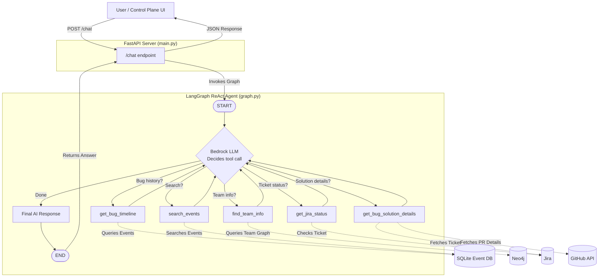

# Chatbot Agent (Agent 4) Architecture

The **Chatbot** is the user-facing interface of the KAOS system. Unlike the other agents (which are deterministic state machines), the Chatbot **legitimately uses an LLM** (AWS Bedrock) because it must interpret free-text questions and decide which tool to invoke. It runs as a **FastAPI server** (not a Kafka consumer).

## System Architecture

---

## Directory & File Breakdown

### `1. main.py`

**Role:** FastAPI Server & Entry Point

- **Startup:** Compiles the LangGraph ReAct agent once via `build_chatbot_graph()`.
- **Endpoint:** `POST /chat` accepts a `ChatRequest` (question + user_id), invokes the graph, and returns the final AI-synthesized answer.
- **CORS:** Configured to allow requests from the Control Plane UI.
- **Port:** Runs on `8001` to avoid conflicts with the Ingestion server (8000) and Control Plane (8080).

### `2. graph.py`

**Role:** LangGraph ReAct Agent Builder

- **LLM:** Uses AWS Bedrock (`amazon.nova-lite-v1:0`) with tools bound via `create_react_agent`.
- **System Prompt:** Instructs the LLM on how to use each tool, how to format responses, and rules for synthesizing outputs.
- **Tools:** Imports all 5 chatbot tools from `shared/tools/chatbot.py`.
- **Loop:** LangGraph's built-in ReAct loop handles the think → tool call → observe → respond cycle automatically.

### `3. __init__.py`

**Role:** Package Definition — marks the directory as an importable module.

> [!NOTE]
> **Why an LLM here?** The Chatbot must interpret ambiguous, natural-language questions like "What happened with PaymentService last week?" and decide whether to call `get_bug_timeline`, `search_events`, or both. This is inherently non-deterministic and requires language understanding — making it the one agent where an LLM is justified.
