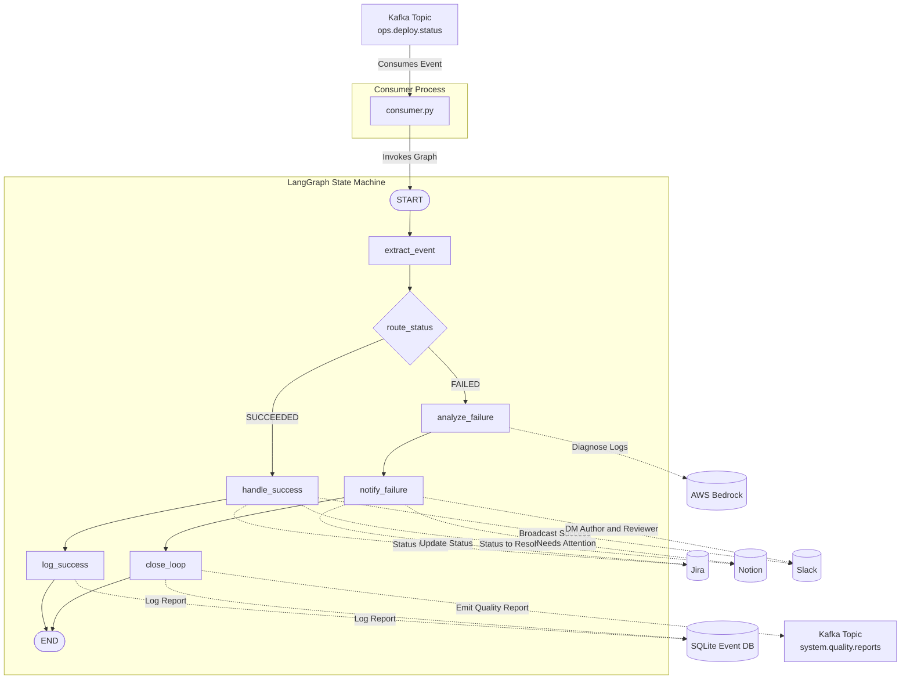

# Ops Manager (Agent 3) Architecture

The **Ops Manager** handles the post-deployment phase of the KAOS pipeline. It listens for deployment outcome events from AWS CodePipeline (via the `ops.deploy.status` Kafka topic) and deterministically routes them through a LangGraph state machine.

The only AI/LLM call in this agent is `analyze_deployment_failure`, which invokes **AWS Bedrock** to diagnose failure logs. Everything else is pure, deterministic Python.

## System Architecture

---

## Directory & File Breakdown

### `1. consumer.py`

**Role:** The Entry Point & Message Broker

- **Inheritance:** Inherits from `BaseAgentConsumer`, consistent with the Triager and Review Manager.
- **Initialization:** Compiles the LangGraph (`build_ops_graph()`) once on startup.
- **Execution:** Listens to the `ops.deploy.status` topic. On each message, it invokes the compiled graph with the raw Kafka payload.

### `2. graph.py`

**Role:** The Brain (Deterministic State Machine + Bedrock AI)

- **State Management:** Defines `OpsState` as a `TypedDict` holding execution details, author/reviewer info, and the AI diagnosis.
- **Nodes:**
  - `extract_event`: Parses the Kafka payload into typed fields.
  - `handle_success`: Updates Jira (Done), Notion (Resolved), broadcasts to Slack.
  - `log_success`: Persists the deployment report to the event database.
  - `analyze_failure`: Calls AWS Bedrock to diagnose the failure logs (the **only LLM call**).
  - `notify_failure`: Updates Jira/Notion, sends personalized Slack DMs to author and reviewer.
  - `close_loop`: Emits a quality report back to Agent 1 (Triager) via Kafka, closing the feedback loop.
- **Edges:** A conditional edge (`route_status`) branches on `SUCCEEDED` vs `FAILED`.

### `3. __init__.py`

**Role:** Package Definition — marks the directory as an importable module.

> [!NOTE]
> **Closed-Loop Architecture:** On failure, the Ops Manager emits a `CRITICAL` quality report back to the `system.quality.reports` Kafka topic. This re-triggers **Agent 1 (Triager)**, which creates a new ticket with a `suggested_assignee` (the original PR author), completing the feedback loop without any human intervention.
