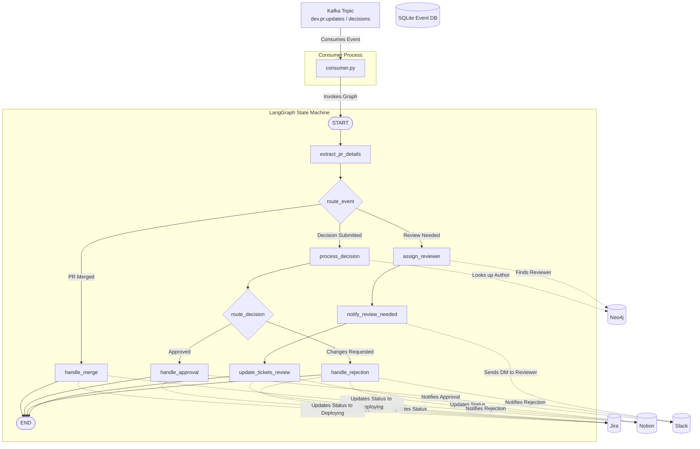

# Review Manager (Agent 2) Architecture

The **Review Manager** listens to Pull Request lifecycle events (usually fired via GitHub Webhooks into the `dev.pr.updates` and `dev.pr.decisions` Kafka topics) and routes them through a deterministic LangGraph.

## System Architecture

---

## Directory & File Breakdown

The `agents/review_manager/` folder is lean and modular. All integration logic (connecting to Jira, Slack, etc.) has been abstracted into the `shared/tools/` package, leaving the Review Manager folder solely responsible for business logic and routing.

### `1. consumer.py`
**Role:** The Entry Point & Message Broker
- **Inheritance:** Inherits from `BaseAgentConsumer` and listens to the GitHub webhook Kafka topics (`dev.pr.updates` and `dev.pr.decisions`).
- **Execution:** Extracts the payload and passes it directly to `graph.invoke()`.

### `2. graph.py`
**Role:** The Brain (Deterministic State Machine)
- **State Management:** Defines the `ReviewState` TypedDict to hold information as it flows through the graph (like the PR ID, Author, Reviewer Slack ID, Decision).
- **Conditional Routing:** Uses `Conditional Edges` (like `route_event` and `route_decision`) to accurately branch the logic based on the payload event type, ensuring strict control over the PR lifecycle.
