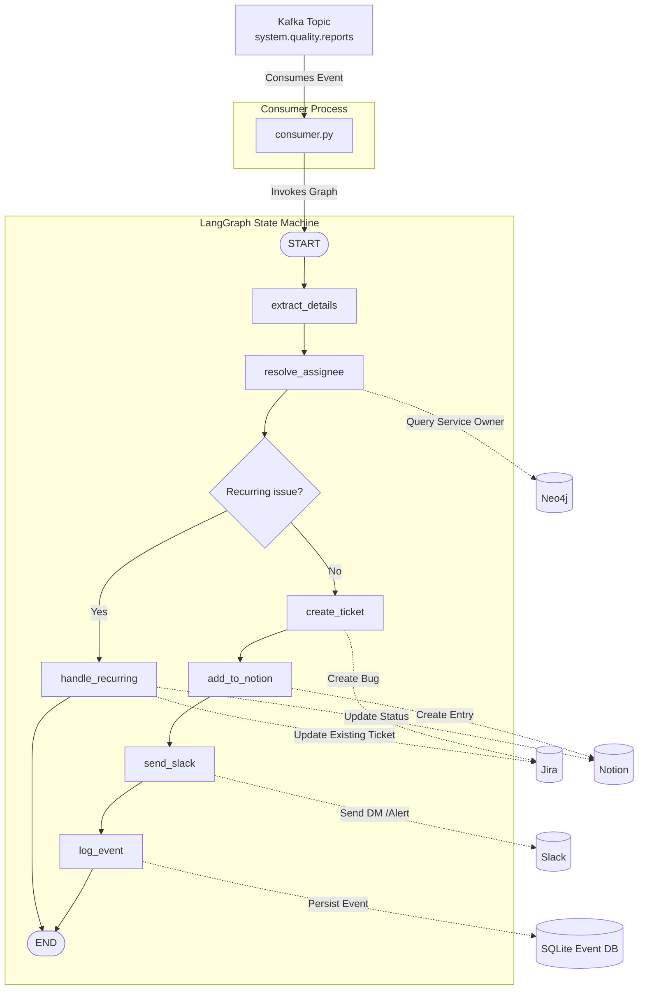

# Triager Agent (Agent 1) Architecture

The **Triager** is the first line of defense in the KAOS event-driven architecture. It functions as a deterministic state machine built on `langgraph`, operating without any unpredictable LLM logic. Its sole purpose is to consume failure events from Kafka, identify the service owner, create tickets, and notify the engineering team.

## System Architecture

The Triager operates as a Kafka consumer that routes incoming payloads (`system.quality.reports`) through a defined graph of execution nodes.

---

## Directory & File Breakdown

The `agents/triager/` folder is lean and modular. All integration logic (connecting to Jira, Slack, etc.) has been abstracted into the `shared/tools/` package, leaving the Triager folder solely responsible for business logic and routing.

### `1. consumer.py`

**Role:** The Entry Point & Message Broker

- **Inheritance:** Inherits from `BaseAgentConsumer`, standardizing Kafka connection and offset management.
- **Initialization:** Compiles the LangGraph (`build_triager_graph()`) exactly once when the agent boots up.
- **Execution:** Listens to the `system.quality.reports` topic. Whenever a message arrives (from a Sentry webhook or the Ops Manager), it invokes the compiled graph, passing the Kafka payload as the initial `TriagerState`.

### `2. graph.py`

**Role:** The Brain (Deterministic State Machine)

- **State Management:** Defines `TriagerState` as a `TypedDict`. This state dictionary is passed from node to node, mutating as it flows (e.g., adding the `issue_key` or `assignee_name`).
- **Nodes:** Every step in the workflow is a pure Python function (Node).
  - `extract_details`: Normalizes the incoming JSON.
  - `resolve_assignee`: Invokes `find_service_owner` (Neo4j) to find the right developer.
  - `check_recurring`: Queries the database to see if a Jira ticket already exists for this service.
  - `create_ticket` / `add_to_notion` / `send_slack` / `log_event`: Invokes the respective `shared.tools` to interact with external APIs.
- **Edges:** Wires the nodes together sequentially. Features a conditional edge (`route_after_recurring_check`) that skips the ticket creation phase if the bug is a recurring instance of a known issue.

### `3. __init__.py`

**Role:** Package Definition

- Standard Python file that marks the directory as an importable module.

> [!NOTE]
> **No LLMs Used Here:** Unlike the Ops Manager or Review Manager, the Triager does not use Large Language Models (LLMs) to make decisions. Because ticket creation and routing is a strict, rule-based process, using a deterministic LangGraph setup ensures 100% reliability and speed.
