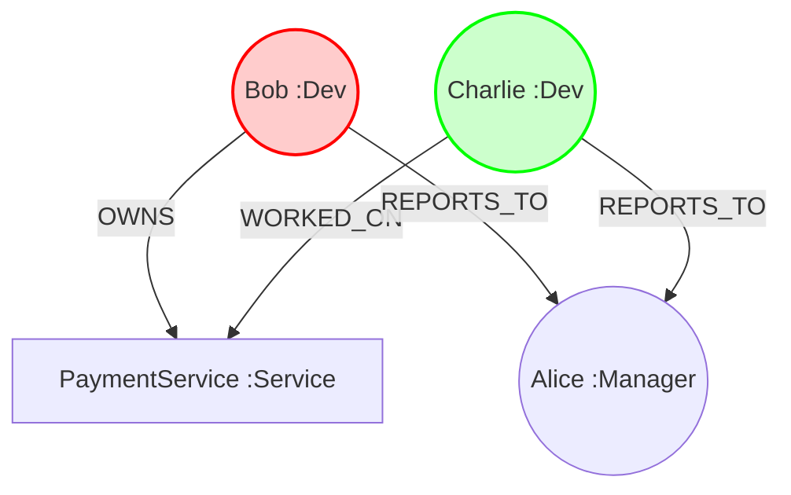

# KAOS Graph Schema

This document defines the schema for the Neo4j Knowledge Graph.

## Nodes

### `(:Person)`
Represents an employee.
- **name**: `String` (e.g., "Bob")
- **role**: `String` (e.g., "Developer", "Manager")
- **status**: `String` (Important for routing!)
    - Values: `"Active"`, `"On_Leave"`, `"Inactive"`
- **slack_id**: `String` (e.g., "U12345")
- **email**: `String`

### `(:Service)`
Represents a software component.
- **name**: `String` (e.g., "PaymentService")
- **repo_url**: `String` (Optional)

## Relationships

### `[:OWNS]`
- `(Person)-[:OWNS]->(Service)`
- Indicates the primary owner/maintainer of a service.
- **Usage:** Agent 1 checks this first.

### `[:WORKED_ON]`
- `(Person)-[:WORKED_ON]->(Service)`
- Indicates a developer has contributed code to this service (extracted from Git history).
- **Usage:** Backup if Owner is away.

### `[:REPORTS_TO]`
- `(Person)-[:REPORTS_TO]->(Person)`
- Indicates the management hierarchy.
- **Usage:** Escalation path if Owner & Team are unavailable.

## Example Query
This Cypher query finds the active owner or escalates:

```cypher
MATCH (p:Person)-[:OWNS]->(s:Service {name: 'PaymentService'})
OPTIONAL MATCH (p)-[:REPORTS_TO]->(m:Person)
RETURN p, m
```

## Diagrams



## How to Visualize in Neo4j Browser

To see the live graph, run this Cypher query in your **Neo4j Aura Console**:

```cypher
MATCH (n)-[r]->(m) RETURN n, r, m
```

This will display all nodes and relationships in an interactive graph view.
